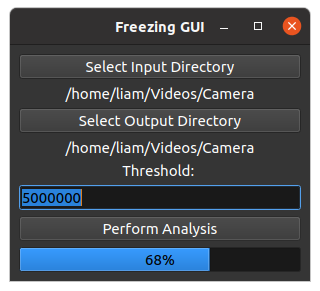

# ZapCapture
 A computer vision program to extract lightning strikes! ⚡

<!-- PROJECT SHIELDS -->
<!--
*** I'm using markdown "reference style" links for readability.
*** Reference links are enclosed in brackets [ ] instead of parentheses ( ).
*** See the bottom of this document for the declaration of the reference variables
*** for contributors-url, forks-url, etc. This is an optional, concise syntax you may use.
*** https://www.markdownguide.org/basic-syntax/#reference-style-links
-->
[![Contributors][contributors-shield]][contributors-url]
[![Forks][forks-shield]][forks-url]
[![Stargazers][stars-shield]][stars-url]
[![MIT License][license-shield]][license-url]

<!-- PROJECT LOGO -->
 

  

  <h3 align="center">ZapCapture</h3>

  

    A python program that extracts lightning images/gifs from videos of storms! ⚡
  

<!-- TABLE OF CONTENTS -->

  
<h2 style="display: inline-block">Table of Contents</h2>

  <ol>
    <li>
      <a href="#about-the-project">About The Project</a>
      <ul>
        <li><a href="#built-with">Built With</a></li>
        <li><a href='#roadmap'>Roadmap</a></li>
      </ul>
    </li>
    <li><a href="#design">Design</a></li>
    <li><a href="#instructions">Instructions</a></li>
    <li><a href="#license">License</a></li>
    <li><a href="#contact">Contact</a></li>
    <li><a href="#acknowledgments">Acknowledgments</a></li>
  </ol>

<!-- ABOUT THE PROJECT -->
## About The Project

Sometimes I like to set up my camera during storms, but watching hours of footage after a lightning storm is time consuming and not very fun. I went to find an existing script to perform this task, and found one written in Python 2 by programmer and mad scientist [Saulius Lukse](https://lukse.lt/uzrasai/2015-05-lightning-strikes-and-python/). I converted the handy script to Python 3, and fit the whole thing into a Jupyter notebook for easy access.

After showing off my cool pictures, people expressed serious interest in running the software themselves. This wraps the project in a GUI and make it easy enough
for stormchasers and tinkerers to use, while adding additional features like mp4 output support and a progress visual.

Now I have tested the program with hours upon hours of footage, detecting lightning, red sprites, and ELVES from storm footage provided by others and myself. Please enjoy this program, and if you get good lightning strikes, please share them with me!

### Built With

* [Python](https://www.python.org/)
* [OpenCV](https://opencv.org/)
* [Pillow](https://pillow.readthedocs.io/en/stable/)
* [Tkinter](https://docs.python.org/3/library/tkinter.html)
* [imageio](https://pypi.org/project/imageio/)
* [Atom](https://atom.io/)

<!--Project Roadmap -->
## Roadmap
#### V0 ✔️ (See Independent Repository)
* Script in a Jupyter Notebook. ✔️

#### V1 ✔️
* Implement a working GUI that is OS independent. ✔️

#### V2 ✔️
* Quality of Life Features & Bug Testing
 * requirements.txt ✔️
 * Graphics overhaul for less ugly interface ✔️
 * Multi-threading for faster processing ✔️
 * Progress bar ✔️
 * Error handling to give feedback during analysis ✔️
 * Saved file frame/timestamp option ✔️
 * Detection dead-zone ✔️
 * MP4 output mode for cool multi-frame lightning ✔️
 * Fix crash after analysis ✔️
 * Windows Installation ✔️

#### Future Features
These features may or may not be written in the future, depending on interest in the program and my ability to keep working on it.
* [Red Sprite](https://en.wikipedia.org/wiki/Sprite_(lightning)) mode.
 * I have acquired some test footage (thanks to Stephen C Hummel for submitting extensive footage!) for this feature, so this is the next anticipated feature. It will specifically detect and extract red sprites, useful for research and photography. Currently, ZapCapture WILL detect sprites, but only when also detecting lightning. This fills up the output file list and is only marginally better than going through the video manually.
* Automatic Threshold Setting
 * Analyze a short section of video, automatically determine an appropriate threshold, and apply to the video. Repeat for each video, to prevent unique video settings like time of day from affecting the result. This will cause analysis to take longer, but it should improve the user experience and result in more accurate detection given a variety of videos.
* Live View During Processing
 * Having a live view of the video, or at least a way to see the gif outputs, would improve user feedback during processing. At the moment, if the progress bar is moving slowly, there is no way to tell if ZapCapture has frozen or is working. Seeing images and gifs populate a field would fix this lack of feedback, and give a fast sense of the image quality/strike frequency while running.

<!-- DESIGN DESCRIPTION -->
## Design

ZapCapture takes a folder full of videos and uses OpenCV to detect differences between footage frames. If the difference exceeds a user-defined threshold, then the image is saved as a PNG. You can tune the detection threshold to suit your individual video; on a ten minute video, ZapCapture can extract less than a hundred frames or several thousand, depending on the threshold. Sequences of frames will also be saved as gif files, so that you can watch strikes happen in slow-motion.

  

<!-- USING THE SOFTWARE -->
## Instructions

#### Windows 10

Download the windows installer and follow the instructions to install.

Uninstall ZapCapture through the Windows Application Manager as you would any other application.

#### Linux

Instructions for Linux coming soon.

<!-- Download and install the ZapCapture application for Windows. Run the application. -->

<!--
#### Windows 10

Download the assets folder and LightningGUI.exe, and store them in the same place. Simply run the .exe from there! The .exe was never meant to be a long-term
solution, but simply a minimum viable test tool for some of my friends.

#### Linux

Download the assets folder and LightningGUI file, and store them in the same place. You can run the file from command line with

`$ ./LightningGUI`

-->

#### Processing

1. Use the input and output folder buttons to select a folder with lightning videos and an empty folder.
2. Set an appropriate threshold for your videos. The higher the threshold, the faster the process will run and the less output images you will get. You will have to experiment to find the best threshold, but starting high and going lower is the best approach. The default threshold is too high for almost any detections to occur, so you will need to delete a 0 or two for the best results. If you are having trouble, check the csv outputs and pick a threshold value that is higher than the typical detection value.
3. Select a file name convention- frame number or timestamp (seconds-milliseconds format).
4. Finally, click 'Analyze!' and wait a bit. The program will take a few minutes to run. Once analysis is finished, your output folder will contain all of the image and mp4 files, as well as a csv giving threshold data for each frame on every file.

#### Building

Interested in building ZapCapture on your system? To build ZapCapture, you need to have Python 3.6 or later. Clone this repository, and use pip to install the requirements.txt file.

`$ python -m pip install -r requirements.txt`

Run LightningGUI.py to analyze some lightning!

If you would like to run from an executable instead of python, use pyinstaller.

`$ cd Downloads/Lightning-Analyzer-GUI `

`$ pyinstaller LightningGUI.py --onefile --icon logo.ico`

If you don't want to see debugging info, add `--noconsole` to the pyinstaller command. Now, you will find a folder called `dist` with an executable inside!

<!-- LICENSE -->
## License

Distributed under the MIT License. See `LICENSE` for more information.

<!-- CONTACT -->
## Contact

Liam Plybon - lplybon1@gmail.com - www.blablabliam.github.io

Project Link: [https://github.com/blablabliam/ZapCapture](https://github.com/blablabliam/ZapCapture)

Like it enough to spend money? Don't feel pressured.

<!-- ACKNOWLEDGEMENTS -->
## Acknowledgments

* [Saulius Lukse](https://lukse.lt/uzrasai/2015-05-lightning-strikes-and-python/)
* Astronomer Stephen C Hummel

<!-- MARKDOWN LINKS & IMAGES -->
<!-- https://www.markdownguide.org/basic-syntax/#reference-style-links -->
[contributors-shield]: https://img.shields.io/github/contributors/blablabliam/ZapCapture.svg?style=for-the-badge
[contributors-url]: https://github.com/blablabliam/ZapCapture/graphs/contributors
[forks-shield]: https://img.shields.io/github/forks/blablabliam/ZapCapture.svg?style=for-the-badge
[forks-url]: https://github.com/blablabliam/ZapCapture/network/members
[stars-shield]: https://img.shields.io/github/stars/blablabliam/ZapCapture.svg?style=for-the-badge
[stars-url]: https://github.com/blablabliam/ZapCapture/stargazers
[issues-shield]: https://img.shields.io/github/issues/blablabliam/ZapCapture.svg?style=for-the-badge
[issues-url]: https://github.com/blablabliam/ZapCapture/issues
[license-shield]: https://img.shields.io/github/license/blablabliam/ZapCapture.svg?style=for-the-badge
[license-url]: https://github.com/blablabliam/ZapCapture/blob/master/LICENSE.txt
